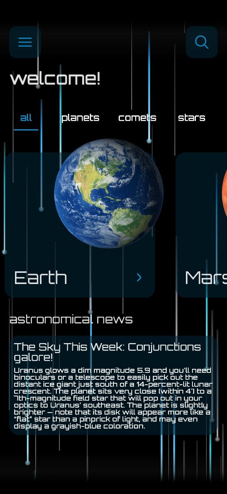

# Raining Lights

RainingLights is a library designed to bring beautiful, dynamic loading animations to your Android apps using Jetpack Compose.

This project is a showcase for a library developed in **Kotlin Jetpack Compose**, 
whose main feature is the ability to have a live raining light background. 

The library is easy to implement and use, 
providing developers with a simple API to add a live raining light background to their applications. 
 
This project serves as a showcase for the RainingLights library, 
providing users with a working example of the library's implementation. 
The app is designed using modern principles and the latest Android development frameworks, 
including Jetpack Compose and Material Design components.

## Give a Star! ⭐
If you like or are using this project to learn or start your solution, please give it a star. Thanks!

| MainScreen | DetailScreen | 
| :---: | :---: | 
|  |   | 

To use the library in your own project, follow these steps:

[](https://jitpack.io/#razaghimahdi/RainingLightsAnimation)

### Step 1. Add it in your project-level `build.gradle` or `settings.gradle` file:
Add the following code to your project-level build.gradle or settings.gradle file:

	allprojects {
		repositories {
			...
			maven { url 'https://jitpack.io' }
		}
	}

### Step 2. Add the dependency
Add the following dependency to your app-level build.gradle file:

	dependencies {
	        implementation 'com.github.razaghimahdi:RainingLightsAnimation:1.0.2'
	} 

### Step 3. How to use
To use the library, simply create a RainingLightsBox composable function and wrap your existing content inside it, 
as shown in the example code below:
```kotlin

RainingLightsBox(
    modifier = Modifier
        .fillMaxSize()
        .background(color = MaterialTheme.colors.background)
) {
    // content
}

```
That's it! With these simple steps, you can now add beautiful, dynamic loading animations to your Android apps using the RainingLights library.


https://user-images.githubusercontent.com/61207818/227785925-3350e972-d96d-49cb-a056-10d5ad5cd5a0.mp4


Developed by Mahdi Razzaghi Ghaleh
